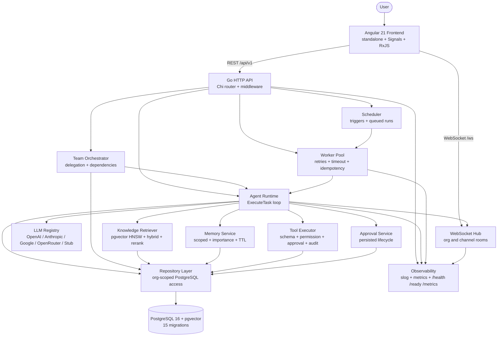
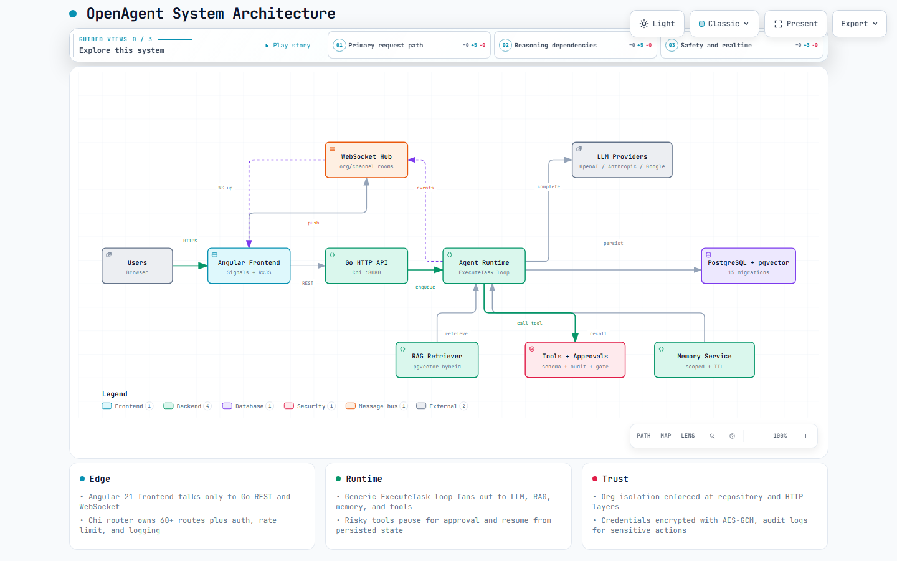
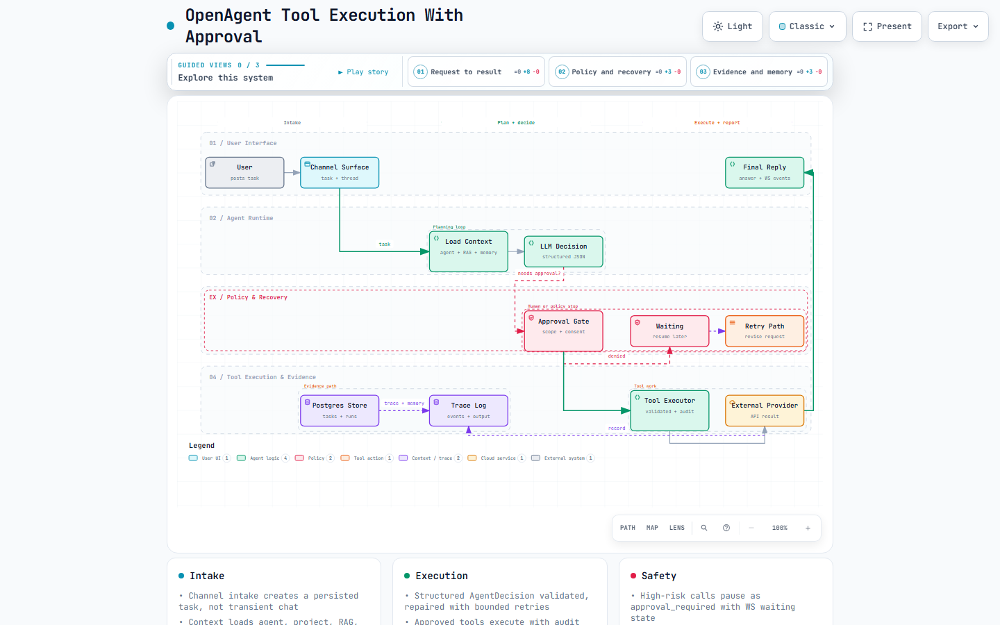
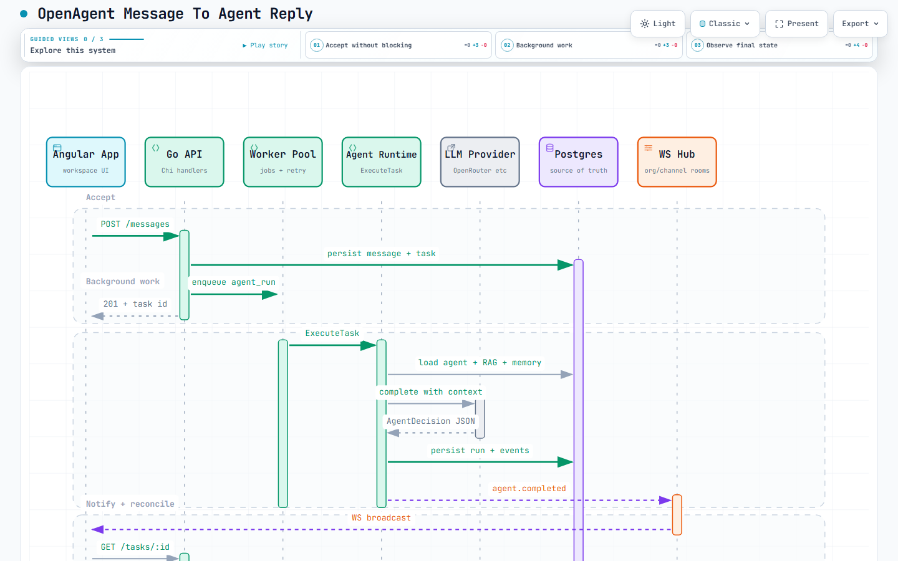
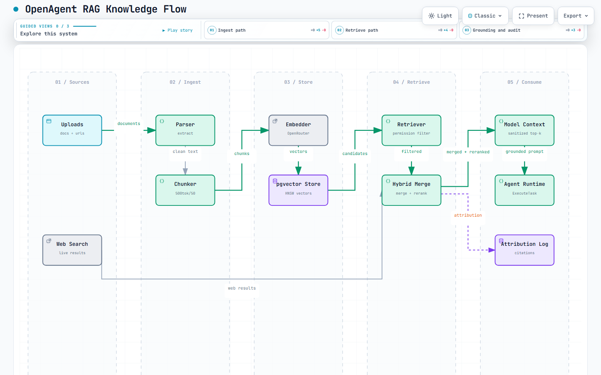

# OpenAgent

A production-oriented human + AI collaborative workspace with LLM agents, RAG, tool execution, approvals, and real-time collaboration.

OpenAgent is a full-stack collaborative workspace where AI agents are first-class members of an organization. Agents execute tasks, use tools, retrieve permission-scoped knowledge, maintain memory, delegate work, request human approval, and communicate through realtime channels.

This repository is the public engineering showcase of the project and contains the core application source, selected documentation, tests, and implementation examples. Internal/private design documentation and production-sensitive material are intentionally excluded.

## 1. Overview

OpenAgent is built as a full-stack system rather than a chatbot demo. The Go backend owns task execution, persistence, authorization, retrieval, tool execution, approvals, scheduling, worker control, and observability. The Angular frontend provides workspace, channel, task, agent, team, knowledge, approval, and realtime views.

The central design choice is a generic agent runtime: provider-specific code lives behind an LLM abstraction, tools live behind a registry/executor, knowledge lives behind a permission-filtered retriever, and all state transitions are persisted in PostgreSQL.

Selected entry points:

- `backend/internal/runtime/runtime.go` — generic `ExecuteTask` loop
- `backend/internal/runtime/decision.go` — structured `AgentDecision` parsing/validation
- `backend/internal/llm/provider.go` — provider/embedder abstraction and registry
- `backend/internal/tool/executor.go` — permission, approval, audit, idempotency
- `backend/internal/knowledge/retriever.go` — permission-filtered semantic/hybrid search
- `backend/internal/ws/hub.go` — org/channel rooms and broadcast
- `backend/internal/http/router.go` — Chi router, 60+ routes, middleware chain

## 2. What the project demonstrates

- Go backend engineering with service/repository layering and org-scoped persistence
- React-style modern frontend engineering in Angular 21 (standalone components, Signals, RxJS)
- Provider abstraction supporting multiple LLM vendors without leaking SDKs into domain code
- Structured LLM decisions with validation and repair retries
- Tool orchestration with schema validation, permissions, approvals, audit, and idempotency
- Permission-aware RAG over PostgreSQL + pgvector
- Scoped agent memory with importance, expiration, and vector retrieval
- Multi-agent teams, delegation, task dependencies, and cycle detection
- Human-in-the-loop approvals with resumable execution
- WebSocket realtime collaboration with room isolation
- Tenant isolation, JWT auth, RBAC, sanitization, and credential encryption
- Metrics, structured logging, health/readiness, correlation IDs, rate limiting
- Database migrations, unit/integration tests, and Playwright E2E scaffolding

## 3. Core capabilities

- **Agent execution:** bounded loop with persisted `agent_runs`/`agent_actions`, cancellation, timeouts, and retries for malformed model output
- **Multi-provider LLM:** OpenAI, Anthropic, Google, OpenRouter, local OpenAI-compatible endpoints, plus stub for development/tests
- **Tools:** registry-based definitions with JSON Schema, risk levels, required permissions, and approval policies; 9+ seeded tools
- **Approvals:** pending/approved/rejected/expired/cancelled lifecycle; execution pauses and resumes on decision
- **Knowledge/RAG:** ingestion (parse/normalize/chunk/embed/store), pgvector HNSW search, keyword search, hybrid merge, reranker hook, attribution
- **Memory:** working/project/agent/conversation types with TTL and importance thresholds
- **Teams:** team builder, team workflows, delegation depth bound (5), dependency cycle detection (BFS)
- **Autonomy:** project-event handling and timezone-aware scheduled triggers producing queued agent runs
- **Realtime:** `org:<id>` auto-join, `channel:<id>` join/leave with validation, typed events for messages, agents, tasks, teams, tools, approvals
- **Security:** org isolation at repository layer, JWT HS256, RBAC (owner/admin/member), sanitization, tool input validation, AES-GCM credential encryption
- **Operations:** execution budgets, rate limits, worker retries with exponential backoff, timeouts, idempotency keys, audit logs

## 4. Architecture



The diagram reflects the actual implementation: the frontend only talks to the backend over REST and WebSocket; the runtime fans out to LLM, retrieval, memory, tools, and approvals; all tenant data flows through the org-scoped repository to PostgreSQL + pgvector.

Explorable exhibits live in [`docs/diagrams/`](docs/diagrams/) (interactive HTML + PNG previews, Archify showcase-validated 9/9 each). Click any image to open its interactive exhibit:

### System architecture — components and trust boundaries

[](docs/diagrams/architecture.html)

### Tool execution with approval — planning loop and safety gates

[](docs/diagrams/workflow-tool-approval.html)

### Message to agent reply — full request lifecycle

[](docs/diagrams/sequence-message-reply.html)

### RAG knowledge flow — ingest to grounded prompt

[](docs/diagrams/dataflow-rag.html)

## 5. Technology stack

| Layer | Technology |
|---|---|
| Frontend | Angular 21.2, standalone components, Signals, RxJS 7.8, TypeScript 5.9, Vitest |
| Backend | Go 1.25, Chi v5, pgx v5, golang-jwt v5, gorilla/websocket, slog |
| Database | PostgreSQL 16 + pgvector (HNSW), pgcrypto, pg_trgm |
| Vector search | pgvector HNSW + hybrid keyword/vector retrieval |
| Realtime | WebSocket with room isolation, optional Redis broadcaster for horizontal scale |
| Auth | JWT HS256 + organization-scoped RBAC |
| LLM | OpenAI, Anthropic, Google, OpenRouter, local OpenAI-compatible, stub |
| Infra | Docker Compose (postgres + redis + backend + frontend + migrate), Make |
| Testing | Go tests (`go test ./...`), frontend Vitest, Playwright E2E scaffolding |

## 6. Repository structure

```text
backend/
  cmd/server/main.go          composition root, DB pool, worker, scheduler wiring
  cmd/migrate/main.go         migration runner
  migrations/000001-000015_*.sql  orgs/users, agents/teams, projects/channels,
                                  tasks/runs, knowledge/vectors, tools/approvals,
                                  memory/triggers, distributed/event-idempotency
  internal/
    runtime/       ExecuteTask loop, AgentDecision, retries, guards, resume, aggregation
    llm/           Provider/Embedder interfaces, Registry, OpenRouter + stub clients
    tool/          Registry (schema/approval policy), Executor (permission/audit/idempotency)
    approval/      approval lifecycle service
    knowledge/     ingestion/chunking/parser, retriever (semantic/hybrid/rerank)
    memory/        scoped memory service + consolidation
    team/          team builder + orchestrator (depth/cycle guards)
    worker/        background pool (backoff, timeout, cancellation, idempotency)
    scheduler/     trigger evaluation and scheduled task creation
    autonomy/      project-event autonomous handling
    guardrail/     budgets and execution limits
    builder/       NL-to-structured agent/team preview
    integration/   external provider abstraction, AES-GCM credentials, mock providers
    browser/       managed browser tools with policy and audit
    repository/    org-scoped PostgreSQL persistence, vector/keyword search
    ws/            Hub (rooms/broadcast/dedup), Redis broadcaster, client pumps
    http/          router, middleware (requestID/logging/recover/CORS/auth/ratelimit),
                   handlers (auth/org/project/channel/message/agent/team/task/run/
                   knowledge/memory/tool/approval/trigger/metrics/health)
    auth/          JWT + bcrypt
    config/        env loading and production validation
    domain/        shared structs (no external deps)
    security/      sanitization, prompt hardening, tool input validation
    metrics/       atomic counters and Prometheus handler
    logger/        slog setup
    evaluation/    run evaluation helpers
    service/       thin business logic
    article/       article workflow domain helpers
    assistant/     default assistant bootstrap

frontend/
  src/app/
    core/          api, auth, agent, task, team, channel, message, knowledge,
                   memory, tool, approval, integration, scheduler, settings,
                   ws, state services
    features/      agents, teams, tasks, runs, channels, articles, knowledge,
                   memories, approvals, tools, integrations, browser, projects,
                   dashboard, scheduler, settings, status, assistant, auth
    layout/        shell with realtime fan-out
    shared/        reusable UI primitives
  src/environments/ dev/prod API and WS bases
  proxy.conf.json  dev proxy for /api and /ws

docs/
  api.md, api-conventions.md, tools.md, runtime.md,
  deployment.md, development.md, env.md, production-readiness.md
docker-compose.yml / docker-compose.playwright.yml
.env.example        placeholders only, no real credentials
Makefile            migrate-up/down, test, lint, run-backend/frontend
```

## 7. Agent execution flow

Implemented in `backend/internal/runtime/` (`runtime.go`, `execution.go`, `context.go`, `decision.go`, `retry.go`, `guards.go`, `resume.go`, `aggregation.go`):

1. Load agent definition (`GetAgent` + version), project context, task, and memory (`memory.Retrieve`)
2. Retrieve RAG context via `knowledge.Retriever` with permission filtering
3. Sanitize all untrusted content (`security.SanitizeUserContent`, `SanitizeDocumentContent`) and build a hardened system prompt (`SystemPromptHardening` + agent instructions)
4. Invoke the selected provider through `llm.Registry` (`CompletionRequest` with model/messages/tools)
5. Parse and validate a structured `AgentDecision` (`response`, `status`, `actions`, `memory_updates`); on validation failure, repair with a bounded retry (`retryDecision`, `MaxDecisionRetries`)
6. Execute actions: `send_message` (persist + WS broadcast), `call_tool` (via `tool.Executor`), `create_task`/`delegate_task` (persist + dependency + WS), `request_approval`/`request_human_input`, `update_task`/`complete_task`/`fail_task`, `store_memory`
7. If a tool requires approval, persist `approval_required` state, emit `agent.waiting`, and resume later from persisted tool results (`approval_received`/`approval_rejected` path reloads prior outputs)
8. Enforce `MaxIterations`, `ExecutionTimeout`, delegation depth, cycle checks, and guardrail budgets; finalize `agent_runs` status and emit `agent.completed`/`failed` plus task events
9. Parent aggregation: subtask completion can resume the parent via `checkParentAggregation`

## 8. LLM/provider abstraction

`backend/internal/llm/provider.go` defines `Provider` (`Name`, `Complete`), `Embedder` (`Embed`), and a `Registry` for named providers/embedders. Domain and runtime code depend only on these interfaces.

- `backend/internal/llm/openrouter.go` — OpenRouter chat + embeddings with retry/backoff and fallback handling
- Stub provider/embedder — deterministic 1536-dim embeddings for local dev and tests when no keys are set
- `backend/internal/config/config.go` — selects `LLM_PROVIDER`/`LLM_MODEL`, `OPENAI_*`, `ANTHROPIC_*`, `GOOGLE_*`, `OPENROUTER_*`, `LOCAL_*`; production refuses silent stub fallback and requires a real key
- Usage (`PromptTokens`/`CompletionTokens`) is plumbed into `agent_runs.token_metadata` for cost observability

Adding a vendor means implementing `Complete` (and optionally `Embed`) and registering it — no domain changes.

## 9. Tool execution and approvals

`backend/internal/tool/registry.go` holds tool definitions (`name`, `description`, JSON Schema, `risk_level`, `required_permissions`, `approval_policy`). `backend/internal/tool/executor.go` enforces:

- Schema validation (`ValidateInput`, required/type/enum checks) plus `security.ValidateToolInput` (blocks patterns such as `rm -rf`, `eval(`)
- Permission check via `ListAgentTools` (tool must be assigned and enabled)
- Approval gate via `RequiresApproval` (high/critical/publish paths default to approval)
- Idempotency via `idempotency_key` (SHA256, unique per org, 24h worker window, `GetToolExecutionByIdempotency` dedup)
- Credential resolution via `integration.Decrypt` (AES-GCM) without logging raw secrets (`Redacted`, `isSecretKey`)
- Audit via `tool_executions` rows plus `audit_logs` (`tool_started/succeeded/failed/denied/approval_requested`)

Approval flow (`backend/internal/approval/service.go`):

- Tool needing approval creates an `approvals` row (pending) and a `tool_executions` row (`approval_required`), emits WS `agent.waiting`
- Human calls `POST /approvals/:id/approve|reject|cancel`; executor runs `ExecuteApproved` on approval and the runtime resumes with persisted context

## 10. RAG / knowledge retrieval

`backend/internal/knowledge/ingest.go` implements `upload → parse → normalize → chunk → embed → store → index` (500-token chunks, 50-token overlap, ~4 chars/token, `EstimateTokens`, sanitization before storage). `backend/internal/knowledge/parser.go` handles text/website extraction and normalization.

`backend/internal/knowledge/retriever.go` implements:

- `SemanticSearch` — embed query, over-fetch (`limit*2`), permission-filtered `VectorSearch`, metadata post-filter, optional rerank
- `HybridSearch` — semantic + `KeywordSearch` merge/dedup with boost for hits in both
- Permission filtering via `GetAllowedDocIDs` (org + agent + project + collection union) inside `VectorSearch`, so unauthorized chunks are never returned
- Sanitized, attributed chunks injected into model context with truncation

Storage uses `documents`, `document_versions`, `document_chunks` (vector 1536, HNSW), `embeddings`, collection mappings, and agent/project knowledge grants (see `backend/migrations/000004_phase3_knowledge.sql`).

## 11. Memory

`backend/internal/memory/service.go` provides scoped memories (`memory_type`: working/project/agent/conversation; `scope`; `project_id`; `source`; `importance`; `embedding`; `expires_at`):

- TTL policies (e.g., working short-lived, conversation days) and importance thresholds filter retrieval
- Vector retrieval with `importance >=` and `expires_at` checks
- `store_memory` decisions from the runtime persist via the same service
- Consolidation helpers summarize or expire memories without losing attribution

The runtime loads memories alongside RAG results so short-term task context and long-term agent/project knowledge are both available to the model.

## 12. Real-time collaboration

`backend/internal/ws/hub.go` implements rooms, registration, broadcast buffering, and duplicate suppression (`seen` map). `backend/internal/ws/redis.go` provides an optional Redis broadcaster for horizontal scale.

- Server auto-joins each connection to `org:<id>` on connect
- Client sends `join_channel`/`leave_channel` with UUID validation; private channels are further guarded at the HTTP layer
- Server broadcasts `message.created/updated/deleted`, `reaction.*`, `agent.started/thinking/tool_started/tool_completed/message/task_created/delegated/task_assigned/waiting/completed/failed`, `agent.task_updated`, `team.task_started/escalated`, `tool.approved`, `approval.decided`, `autonomous.task_created`
- Frontend `core/ws.service.ts` reconnects with exponential backoff and forwards events to `MessageService`/`TaskService`; channel views join on init and leave on destroy

## 13. Security considerations

- Tenant isolation enforced at the repository layer (`WHERE organization_id=$1` on every tenant query) plus `IsOrgMember` checks in handlers
- JWT HS256 with 24h TTL, `Authorization: Bearer` for REST and `?token=` for WebSocket (browsers cannot set WS headers), verified in middleware and WS upgrade
- RBAC: owner/admin/member; security-sensitive routes (agent updates, tool assignment, permission grants) require owner/admin
- Content defenses: `SanitizeUserContent` (8k cap, injected-instruction patterns), `SanitizeDocumentContent` (50k truncate), `SystemPromptHardening`, `ValidateToolInput`
- Credentials: `integrations.credentials_encrypted` via AES-GCM derived from `JWT_SECRET` (SHA256); `Redacted()` for logs; `JWT_SECRET` must be ≥32 chars in production
- Transport/edge: CORS, rate limiting (10/s burst 20 per IP/org/path → 429), request IDs, no raw secrets in logs or WS payloads
- Audit: `audit_logs` for tool/approval/task transitions

## 14. Observability

- Structured `slog` JSON logging with `X-Request-ID` and correlation IDs (`tasks`/`agent_runs`/`tool_executions`/`task_events`)
- Atomic metrics (`backend/internal/metrics/metrics.go`): requests, runs, tasks, tools, WS connections, latency; exposed via `GET /metrics` (Prometheus) with rate limiting
- Health/readiness: `GET /health`, `GET /ready` (DB + LLM/embedding readiness checks)
- Task lifecycle visibility: 13 `task_events` types, run status transitions, WS progress events, and frontend run/task detail views
- Frontend surfaces `agentsWorking/Waiting`, `blockedTasks`, `pendingApprovals`, and recent activity on team dashboards

## 15. Testing

- Backend: `go test ./...` covering approval, article, assistant, auth, autonomy, browser, builder, config, guardrail, knowledge (ingest/parser/retriever), llm, memory (service + consolidation), metrics, repository (agents/knowledge/tasks/isolation/home-channel), runtime (including threaded execution), scheduler, security, tool, worker, middleware, and handler authz/critical/message-route/settings suites
- Frontend: Vitest suites (e.g., article/settings/workspace specs) plus `ng build` verification
- E2E: Playwright scaffolding (`backend/Dockerfile.playwright`, `docker-compose.playwright.yml`) and `critical_test.go` for the human→task→agent path

```bash
make test   # cd backend && go test ./... -count=1
make lint   # cd backend && go vet ./... (+ frontend lint if present)
```

## 16. Local development

Prerequisites: Docker, Go 1.25+, Node.js 22+.

```bash
cp .env.example .env
docker-compose up -d postgres
make migrate-up

# backend (new terminal)
cd backend && go run ./cmd/server

# frontend (new terminal)
cd frontend && npm install && npm start
```

- Frontend: `http://localhost:4200` (proxies `/api` and `/ws` to `:8080`)
- Backend: `http://localhost:8080` (`/health`, `/ready`, `/metrics`, `/api/v1/*`, `/ws`)
- Default LLM is `stub` when no keys are set; set `OPENROUTER_API_KEY` (or OpenAI/Anthropic/Google keys) in `.env` for real models without code changes
- Full stack: `docker compose up --build`
- Useful docs: `docs/development.md`, `docs/env.md`, `docs/api.md`, `docs/api-conventions.md`, `docs/tools.md`, `docs/runtime.md`, `docs/deployment.md`

## 17. Engineering highlights

- **No provider leakage:** runtime, tools, retrieval, and teams depend on `llm.Provider`/`Embedder` interfaces, not vendor SDKs
- **Structured decisions over free text:** `AgentDecision` with lenient JSON unmarshalling (unknown fields → `Params`, LLM aliases handled) plus repair retries prevents a single malformed response from failing a run
- **Persistence-first orchestration:** tasks, runs, tool executions, approvals, dependencies, and events are rows, not in-memory state, so approval pauses, worker restarts, and parent aggregation survive process boundaries
- **Defense in depth:** org checks at HTTP and repository layers, schema + semantic tool validation, sanitization before LLM context, encrypted credentials, redacted logs, budgets and rate limits
- **Bounded autonomy:** delegation depth, dependency cycles, iteration caps, timeouts, retries with backoff, idempotency windows, and approval gates prevent runaway execution
- **Realtime without coupling:** the runtime emits typed events to the hub; UI subscribes without direct dependency on execution internals

## 18. Showcase scope / limitations

OpenAgent is a production-oriented collaborative workspace for building and operating LLM-powered agents. This repository is the public engineering showcase of the project and contains the core application source, selected documentation, tests, and implementation examples. Internal/private design documentation and production-sensitive material are intentionally excluded.

- Single-instance staging is the primary target; multi-instance worker/WS/rate-limit scaling is documented as requiring Redis (broadcaster hook already present)
- Vector indexes use HNSW; very large corpora (1M+ chunks) are documented as needing `CREATE INDEX CONCURRENTLY` and `ivfflat`/pooler tuning
- The stub provider enables offline development; real-model behavior (token accounting, cost, latency) requires configured provider keys
- `docs/production-readiness.md` records the hardening evidence and remaining scale-out steps as of the showcased tree

## License

Private / all rights reserved.
